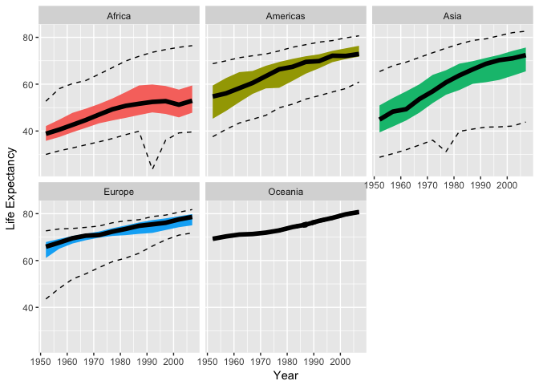

Stat545 Homework 4
================
Eric Sanders
Submitted for 2018-10-09


In this document we present some data exploration completed using the `gapminder` dataset. We will use the packages `tidyverse`, `gapminder`, and `ggplot2`.

``` r
library(tidyverse)
library(ggplot2)
library(gapminder)
```

The sections of this document are as follows:

-   Loading in and Checking the Data
-   Reshaping Prompt: Computing summaries of life expectancy for all combinations of year and continent in the `gapminder` dataset.
-   Joining Prompt: Creating a second data set using `gapminder` and country latitudes and longitudes

Loading in Data and Checking its Structure
==========================================

First, we load the data

``` r
# Call to preloaded data frame
data(gapminder)
attach(gapminder)
```

Next, we can look at some information on how this data set is organized.

``` r
# Determine what we can about the object flchain
str(gapminder)
```

    ## Classes 'tbl_df', 'tbl' and 'data.frame':    1704 obs. of  6 variables:
    ##  $ country  : Factor w/ 142 levels "Afghanistan",..: 1 1 1 1 1 1 1 1 1 1 ...
    ##  $ continent: Factor w/ 5 levels "Africa","Americas",..: 3 3 3 3 3 3 3 3 3 3 ...
    ##  $ year     : int  1952 1957 1962 1967 1972 1977 1982 1987 1992 1997 ...
    ##  $ lifeExp  : num  28.8 30.3 32 34 36.1 ...
    ##  $ pop      : int  8425333 9240934 10267083 11537966 13079460 14880372 12881816 13867957 16317921 22227415 ...
    ##  $ gdpPercap: num  779 821 853 836 740 ...

And we can now see that `gapminder` is of class 'tbl\_df' with 1704 rows and 6 columns. We have two variables that come defined as factors, `country` and `continent`, and the other 4 variables come defined as either numeric or integer objects.

We can look at what the variables in our data set represent.

-   **country**: The country being examined.
-   **continent**: The continent that the country lies in.
-   **year**: The year under observation.
-   **lifeExp**: The life expectancy of the given country in the given year.
-   **pop**: The population of the country in the given year.
-   **gdpPercap**: The GDP per capita of the country in the given year.

Reshaping Prompt (Selected \#3, Summarizing LifeExp in New Dataframes)
======================================================================

We want first to calculate for each continent, for each year, some measure of life expectancy. We decide to use 5 summarizing statistics, the minimum, 1st quartile, median, third quartile, and maximum. Let us first create a new data frame to store this information in, using the `dplyr` functions `summarize` and `group_by`.

``` r
sum.lifeExp = gapminder %>%
  group_by(continent,year) %>%
  summarize(min=min(lifeExp),quart1=quantile(lifeExp)[[2]],med=median(lifeExp),quart3=quantile(lifeExp)[[4]],max=max(lifeExp))

head(sum.lifeExp)
```

    ## # A tibble: 6 x 7
    ## # Groups:   continent [1]
    ##   continent  year   min quart1   med quart3   max
    ##   <fct>     <int> <dbl>  <dbl> <dbl>  <dbl> <dbl>
    ## 1 Africa     1952  30     35.8  38.8   42.1  52.7
    ## 2 Africa     1957  31.6   37.4  40.6   44.8  58.1
    ## 3 Africa     1962  32.8   39.5  42.6   47.8  60.2
    ## 4 Africa     1967  34.1   41.4  44.7   49.5  61.6
    ## 5 Africa     1972  35.4   43.3  47.0   51.5  64.3
    ## 6 Africa     1977  36.8   44.5  49.3   53.9  67.1

And we see that we appear to have properly calculated the five summary statistics of life expectancy for each continent and year combination. The next step would be easier if we had only one summary statistic -- we could make a column for each continent, and for each row (year) we would have the summary statistic.

I decided to challenge myself to see how to most efficiently use a data set like this to create multiple data sets, where each data set contains one summary statistic in the desired format. In other words, instead of simply `spread`ing one summary statistic across continents, I wanted to `spread` by multiple different summary statistics one by one.

After testing out some approaches, I decided to loop through the 5 summary statistics and alternate piping the summary data set into `select` and then into `spread`. The most efficient R code I created is as follows.

``` r
sum.names = c('min','quart1','med','quart3','max')

for(i in 1:length(sum.names)){
  name = sum.names[i]
  
  sum.lifeExp %>%
    select(continent,year,paste(name)) %>% # Only take the summary statistic for this step of the 'for' loop
    spread(key=continent,value=paste(name)) %>% # Make there be a column for each continent
    assign(paste('sum.',name,sep=''),.,envir=.GlobalEnv) # The assign function is used here to declare a new global variable with a name that is pasted and varies with the loop. This is useful when you want to declare a new object with a new name for every iteration of a 'for' loop.
}
```

Inside the `for` loop, for each type of summary statistic, a new data frame was created that has a column for year, and a column for each continent containing the summary statistic in question. The 5 created data frames have the names `sum.min`, `sum.quart1`, `sum.med`, `sum.quart3`, and `sum.max`. We can examine each in turn,

``` r
# Look at minimum life expectancies
knitr::kable(sum.min,caption='Minimum Life Expectancy')
```

|  year|  Africa|  Americas|  Asia|  Europe|  Oceania|
|-----:|-------:|---------:|-----:|-------:|--------:|
|  1952|      30|        38|    29|      44|       69|
|  1957|      32|        41|    30|      48|       70|
|  1962|      33|        43|    32|      52|       71|
|  1967|      34|        45|    34|      54|       71|
|  1972|      35|        47|    36|      57|       72|
|  1977|      37|        50|    31|      60|       72|
|  1982|      38|        51|    40|      61|       74|
|  1987|      40|        54|    41|      63|       74|
|  1992|      24|        55|    42|      66|       76|
|  1997|      36|        57|    42|      69|       78|
|  2002|      39|        58|    42|      71|       79|
|  2007|      40|        61|    44|      72|       80|

``` r
# Look at first quartile life expectancies
knitr::kable(sum.quart1,caption='Lower Quartile Life Expectancy')
```

|  year|  Africa|  Americas|  Asia|  Europe|  Oceania|
|-----:|-------:|---------:|-----:|-------:|--------:|
|  1952|      36|        45|    39|      61|       69|
|  1957|      37|        49|    42|      65|       70|
|  1962|      39|        52|    44|      67|       71|
|  1967|      41|        56|    48|      69|       71|
|  1972|      43|        58|    52|      70|       72|
|  1977|      45|        58|    55|      70|       73|
|  1982|      46|        61|    57|      71|       74|
|  1987|      47|        64|    60|      71|       75|
|  1992|      48|        67|    61|      72|       77|
|  1997|      47|        69|    62|      73|       78|
|  2002|      46|        71|    64|      74|       79|
|  2007|      48|        72|    65|      75|       80|

``` r
# Look at median life expectancies
knitr::kable(sum.med,caption='Median Life Expectancy')
```

|  year|  Africa|  Americas|  Asia|  Europe|  Oceania|
|-----:|-------:|---------:|-----:|-------:|--------:|
|  1952|      39|        55|    45|      66|       69|
|  1957|      41|        56|    48|      68|       70|
|  1962|      43|        58|    49|      70|       71|
|  1967|      45|        61|    54|      71|       71|
|  1972|      47|        63|    57|      71|       72|
|  1977|      49|        66|    61|      72|       73|
|  1982|      51|        67|    64|      73|       74|
|  1987|      52|        70|    66|      75|       75|
|  1992|      52|        70|    69|      75|       77|
|  1997|      53|        72|    70|      76|       78|
|  2002|      51|        72|    71|      78|       80|
|  2007|      53|        73|    72|      79|       81|

``` r
# Look at third quartile life expectancies
knitr::kable(sum.quart3,caption='Upper Quartile Life Expectancy')
```

|  year|  Africa|  Americas|  Asia|  Europe|  Oceania|
|-----:|-------:|---------:|-----:|-------:|--------:|
|  1952|      42|        59|    51|      68|       69|
|  1957|      45|        63|    54|      69|       70|
|  1962|      48|        65|    57|      70|       71|
|  1967|      50|        66|    60|      71|       71|
|  1972|      52|        68|    64|      72|       72|
|  1977|      54|        69|    66|      74|       73|
|  1982|      57|        71|    69|      75|       75|
|  1987|      59|        72|    70|      76|       76|
|  1992|      60|        73|    71|      77|       77|
|  1997|      59|        74|    72|      78|       79|
|  2002|      58|        75|    74|      79|       80|
|  2007|      59|        76|    76|      80|       81|

``` r
# Look at maximum life expectancies
knitr::kable(sum.max,caption='Maximum Life Expectancy')
```

|  year|  Africa|  Americas|  Asia|  Europe|  Oceania|
|-----:|-------:|---------:|-----:|-------:|--------:|
|  1952|      53|        69|    65|      73|       69|
|  1957|      58|        70|    68|      73|       70|
|  1962|      60|        71|    69|      74|       71|
|  1967|      62|        72|    71|      74|       72|
|  1972|      64|        73|    73|      75|       72|
|  1977|      67|        74|    75|      76|       73|
|  1982|      70|        76|    77|      77|       75|
|  1987|      72|        77|    79|      77|       76|
|  1992|      74|        78|    79|      79|       78|
|  1997|      75|        79|    81|      79|       79|
|  2002|      76|        80|    82|      81|       80|
|  2007|      76|        81|    83|      82|       81|

If I wanted to form a plot from these values, I would say the data are **not** in a convenient form to do so. It is most convenient for `ggplot2` and base R to have an output value in one column, and factors in another column, instead of having different columns represent different levels of one factor. For example, if I wanted to plot life expectancy summaries over time in each continent, it is very simple to do with the data frame I created before reshaping, `sum.lifeExp`, as follows.

``` r
ggplot(sum.lifeExp,aes(x=year))+
  geom_line(aes(y=min),linetype='dashed')+ # Add dashed lines for minimum and maximum life expectancy in the year given
  geom_line(aes(y=max),linetype='dashed')+
  geom_ribbon(aes(ymin=quart1,ymax=quart3,fill=continent))+ # Add shaded area to mark interquartile area of life expectancy in the year given
  geom_line(aes(y=med),size=2)+ # Add thick line for median life expectancy in year given
  facet_wrap(~continent)+
  ylab('Life Expectancy')+
  xlab('Year')+
  theme(legend.position='none')
```



The new tables are no good at creating similar plots, and would only be useful if you wanted to make a plot for a single continent at a time, not for making plots for multiple continents.

Joining Prompt (Selected \#1, Complementary Gapminder Dataset)
==============================================================

We can import the data published by Google and written as a CSV on Github as follows

``` r
country.locations = read.csv('https://github.com/albertyw/avenews/raw/master/old/data/average-latitude-longitude-countries.csv',header=T)
country.locations = rename(country.locations,country=Country)
str(country.locations)
```

    ## 'data.frame':    240 obs. of  4 variables:
    ##  $ ISO.3166.Country.Code: Factor w/ 239 levels "AD","AE","AF",..: 1 2 3 4 5 6 7 8 9 10 ...
    ##  $ country              : Factor w/ 240 levels "Afghanistan",..: 5 225 1 9 7 2 11 154 6 13 ...
    ##  $ Latitude             : num  42.5 24 33 17.1 18.2 ...
    ##  $ Longitude            : num  1.5 54 65 -61.8 -63.2 ...

We see we now have, for 240 countries, a latitude and longitude matched with the country's ISO code as well as full country name.

Next, we hope to combine these country coordinates with some of our data contained in the gapminder data set.

If we consider longitude, latitude, and ISO code as 'supplemental' to the gapminder data set, we may be inclined to do a left join of the coordinate data set onto the gapminder data set as follows

``` r
left.joined = left_join(gapminder,country.locations,by='country')
str(left.joined)
```

    ## Classes 'tbl_df', 'tbl' and 'data.frame':    1704 obs. of  9 variables:
    ##  $ country              : chr  "Afghanistan" "Afghanistan" "Afghanistan" "Afghanistan" ...
    ##  $ continent            : Factor w/ 5 levels "Africa","Americas",..: 3 3 3 3 3 3 3 3 3 3 ...
    ##  $ year                 : int  1952 1957 1962 1967 1972 1977 1982 1987 1992 1997 ...
    ##  $ lifeExp              : num  28.8 30.3 32 34 36.1 ...
    ##  $ pop                  : int  8425333 9240934 10267083 11537966 13079460 14880372 12881816 13867957 16317921 22227415 ...
    ##  $ gdpPercap            : num  779 821 853 836 740 ...
    ##  $ ISO.3166.Country.Code: Factor w/ 239 levels "AD","AE","AF",..: 3 3 3 3 3 3 3 3 3 3 ...
    ##  $ Latitude             : num  33 33 33 33 33 33 33 33 33 33 ...
    ##  $ Longitude            : num  65 65 65 65 65 65 65 65 65 65 ...

We see that there is now a latitude, longitude, and ISO code column added to our gapminder data set. However, let us see if there are any countries that were not matched between the data sets.

``` r
# Produce list of countries that did not get matching latitude and longitudes.
left.joined %>%
  filter(is.na(Latitude)) %>%
  select(country) %>%
  as.vector() %>%
  unique()
```

    ## # A tibble: 12 x 1
    ##    country           
    ##    <chr>             
    ##  1 Congo, Dem. Rep.  
    ##  2 Congo, Rep.       
    ##  3 Hong Kong, China  
    ##  4 Iran              
    ##  5 Korea, Dem. Rep.  
    ##  6 Korea, Rep.       
    ##  7 Libya             
    ##  8 Slovak Republic   
    ##  9 Syria             
    ## 10 Tanzania          
    ## 11 West Bank and Gaza
    ## 12 Yemen, Rep.

This is perhaps an indication of differences in naming conventions and syntax -- the gapminder dataset strangely uses short forms for republics, whereas it appears the country location dataset does not. Furthermore, it appears the data sets may have been published at different times, as they use different names for areas experiencing large amounts of war and border dispute.

Whatever the reason, we conclude there are 12 countries that did not get matched and lack coordinate information now.

We do however see that we have accurately added the information that is available (and if desired, we could manually correct country names to perhaps add even more information).

Alternately to this approach, we may perhaps be working with the coordinate data set, and wish to supplement the country data with their population as of 2007. If this was the case, we may write it as the following.

``` r
right.joined = gapminder %>%
  filter(year==2007) %>%
  select(country,pop) %>%
  right_join(country.locations,by='country')
str(right.joined)
```

    ## Classes 'tbl_df', 'tbl' and 'data.frame':    240 obs. of  5 variables:
    ##  $ country              : chr  "Andorra" "United Arab Emirates" "Afghanistan" "Antigua and Barbuda" ...
    ##  $ pop                  : int  NA NA 31889923 NA NA 3600523 NA NA 12420476 NA ...
    ##  $ ISO.3166.Country.Code: Factor w/ 239 levels "AD","AE","AF",..: 1 2 3 4 5 6 7 8 9 10 ...
    ##  $ Latitude             : num  42.5 24 33 17.1 18.2 ...
    ##  $ Longitude            : num  1.5 54 65 -61.8 -63.2 ...

We see that we now have the original `country.locations` data set, but with a new population column that has filled in the 2007 population wherever it has matched country names. If we wonder how many countries did and did not get population data accurately from `gapminder`, we can calculate this as

``` r
length(which(is.na(right.joined$pop))) # Countries with pop data
```

    ## [1] 110

``` r
length(which(!is.na(right.joined$pop))) # Countries w/o pop data
```

    ## [1] 130

So a little less than half of the countries we have coordinate data for were matched with 2007 populations.

However, we are at least confident that the data that we **did** add was accurate and properly matched.

The past two examples have shown us that country naming conventions may cause headaches in cases where data are supposed to be combined, but we do have methods that can reliably at least correctly match the correct parts of partially matched data, and leave the rest for manual correction.

I will now explore some examples which I believe **are not useful** for these data sets, because they are likely to cause confusion and improperly matched data.

First, let us look at `full_join`. I will be using a filter to look at a few choice rows of the data set after it is full joined, to illustrate a point. The filter will pick out all the rows of the data set with 'Congo' in the country name, as you will be able to see that this was an issue when the data sets merged.

``` r
full_join(country.locations,gapminder,by='country') %>%
  filter(grepl('Congo',country))
```

    ##    ISO.3166.Country.Code                               country Latitude
    ## 1                     CD Congo, The Democratic Republic of the        0
    ## 2                     CG                                 Congo       -1
    ## 3                   <NA>                      Congo, Dem. Rep.       NA
    ## 4                   <NA>                      Congo, Dem. Rep.       NA
    ## 5                   <NA>                      Congo, Dem. Rep.       NA
    ## 6                   <NA>                      Congo, Dem. Rep.       NA
    ## 7                   <NA>                      Congo, Dem. Rep.       NA
    ## 8                   <NA>                      Congo, Dem. Rep.       NA
    ## 9                   <NA>                      Congo, Dem. Rep.       NA
    ## 10                  <NA>                      Congo, Dem. Rep.       NA
    ## 11                  <NA>                      Congo, Dem. Rep.       NA
    ## 12                  <NA>                      Congo, Dem. Rep.       NA
    ## 13                  <NA>                      Congo, Dem. Rep.       NA
    ## 14                  <NA>                      Congo, Dem. Rep.       NA
    ## 15                  <NA>                           Congo, Rep.       NA
    ## 16                  <NA>                           Congo, Rep.       NA
    ## 17                  <NA>                           Congo, Rep.       NA
    ## 18                  <NA>                           Congo, Rep.       NA
    ## 19                  <NA>                           Congo, Rep.       NA
    ## 20                  <NA>                           Congo, Rep.       NA
    ## 21                  <NA>                           Congo, Rep.       NA
    ## 22                  <NA>                           Congo, Rep.       NA
    ## 23                  <NA>                           Congo, Rep.       NA
    ## 24                  <NA>                           Congo, Rep.       NA
    ## 25                  <NA>                           Congo, Rep.       NA
    ## 26                  <NA>                           Congo, Rep.       NA
    ##    Longitude continent year lifeExp      pop gdpPercap
    ## 1         25      <NA>   NA      NA       NA        NA
    ## 2         15      <NA>   NA      NA       NA        NA
    ## 3         NA    Africa 1952      39 14100005       781
    ## 4         NA    Africa 1957      41 15577932       906
    ## 5         NA    Africa 1962      42 17486434       896
    ## 6         NA    Africa 1967      44 19941073       862
    ## 7         NA    Africa 1972      46 23007669       905
    ## 8         NA    Africa 1977      48 26480870       796
    ## 9         NA    Africa 1982      48 30646495       674
    ## 10        NA    Africa 1987      47 35481645       673
    ## 11        NA    Africa 1992      46 41672143       458
    ## 12        NA    Africa 1997      43 47798986       312
    ## 13        NA    Africa 2002      45 55379852       241
    ## 14        NA    Africa 2007      46 64606759       278
    ## 15        NA    Africa 1952      42   854885      2126
    ## 16        NA    Africa 1957      45   940458      2315
    ## 17        NA    Africa 1962      48  1047924      2465
    ## 18        NA    Africa 1967      52  1179760      2678
    ## 19        NA    Africa 1972      55  1340458      3213
    ## 20        NA    Africa 1977      56  1536769      3259
    ## 21        NA    Africa 1982      57  1774735      4880
    ## 22        NA    Africa 1987      57  2064095      4201
    ## 23        NA    Africa 1992      56  2409073      4016
    ## 24        NA    Africa 1997      53  2800947      3484
    ## 25        NA    Africa 2002      53  3328795      3484
    ## 26        NA    Africa 2007      55  3800610      3633

We can see that when the data sets joined, because of a naming discrepancy, we now have multiple rows with many NA entries, and the latitudes and longitudes for Congo did not properly match up with the gapminder data.

By using `full_join`, we have forced this naming issue, and this data set is no longer reliable or clean. When we used `left_join` and `right_join`, we had the benefit that the data sets would not force issues such as this upon us.

Now, let us look at inner join. I will this time call the head of the data frame, and then, like last time, I will do the filter after searching for the 'Congo' entries.

``` r
inner.join = inner_join(country.locations,gapminder,by='country')
head(inner.join)
```

    ##   ISO.3166.Country.Code     country Latitude Longitude continent year
    ## 1                    AF Afghanistan       33        65      Asia 1952
    ## 2                    AF Afghanistan       33        65      Asia 1957
    ## 3                    AF Afghanistan       33        65      Asia 1962
    ## 4                    AF Afghanistan       33        65      Asia 1967
    ## 5                    AF Afghanistan       33        65      Asia 1972
    ## 6                    AF Afghanistan       33        65      Asia 1977
    ##   lifeExp      pop gdpPercap
    ## 1      29  8425333       779
    ## 2      30  9240934       821
    ## 3      32 10267083       853
    ## 4      34 11537966       836
    ## 5      36 13079460       740
    ## 6      38 14880372       786

``` r
filter(inner.join,grepl('Congo',country))
```

    ## [1] ISO.3166.Country.Code country               Latitude             
    ## [4] Longitude             continent             year                 
    ## [7] lifeExp               pop                   gdpPercap            
    ## <0 rows> (or 0-length row.names)

We see that the `inner_join` made a beautiful data set, as there are no NAs throughout, but when we called the filter there was no results, meaning we have now completely thrown away our information on Congo simply because of the mismatch in names.

Overall, in cases such as this where there is a chance of naming mismatch, I would say that it is wildly more safe to use left\_join or right\_join (depending on which data set is the main data set and which is supplementing with more information) than to use full\_join or inner\_join, because you run the risk of throwing away data or butchering your data set if you use either of these.
